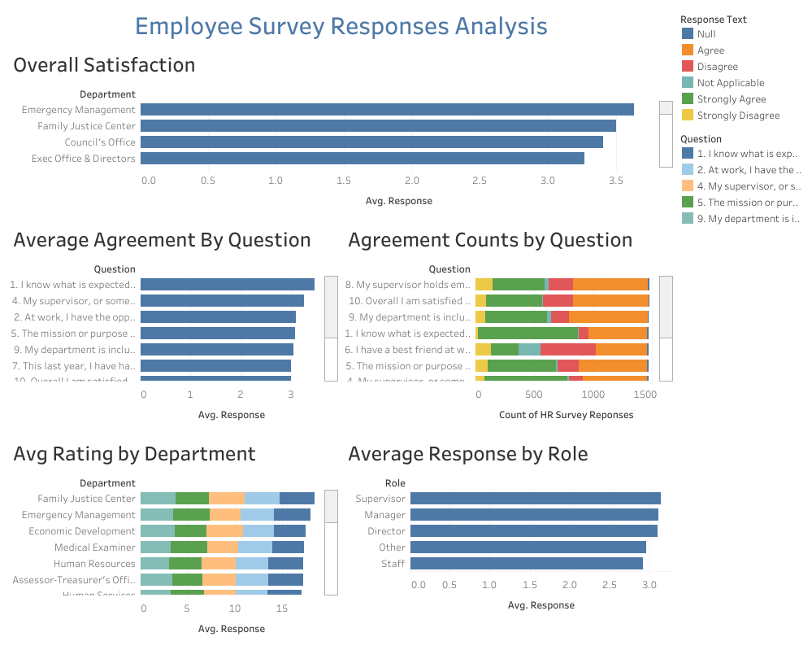

# Employee Survey Responses Analysis - Capstone Project

**Author:** Enoh Umukoro  
**Date:** December 15, 2025  
**Dataset Source:** Pierce County WA Employee Engagement Survey (14,725 responses)

## Project Overview

This capstone project analyzes employee survey responses from Pierce County WA government employees. The dataset contains 14,725 complete responses across 10 survey questions on a 0–4 scale (0 = Not Applicable, 1 = Strongly Disagree → 4 = Strongly Agree).

The analysis was conducted using **Tableau Public (web authoring)** and directly answers the three required questions.

## Data Sources

Single table from Excel file:
- `HR Survey Reponses` — Main data (Response ID, Status, Department, Role flags, Question, Response, Response Text)

Responses filtered to **Complete** status only.

## Dashboard Overview

The interactive dashboard is organized by the three questions, with dedicated visualizations and written insights.

### Question 1: Which survey questions did respondents agree with or disagree with most?

**Visualizations:**
- **Average Agreement by Question** — Horizontal bar of average response score (4 = Strongly Agree)
- **Agreement Counts by Question** — Stacked bar showing count breakdown by response type

**Key Insights:**
- Strongest agreement on:
  - "I know what is expected of me at work"
  - "My supervisor holds employees accountable"
  - "The mission/purpose makes me feel my job is important"
- Weakest agreement on:
  - "In the last seven days, I have received recognition"
  - "I have a best friend at work"
  - Overall job satisfaction (~3.0 average)
- Employees feel clear expectations and purpose, but lack recognition and social connection.

### Question 2: Do you see any patterns or trends by department or role?

**Visualizations:**
- **Avg Rating by Department** — Average score by department (colored by question)
- **Average Response by Role** — Average score by role (Supervisor, Manager, Director, Staff, Other)

**Key Insights:**
- **By Role**: Supervisors and Managers show highest average agreement (~3.1–3.2). Staff have the lowest (~3.0).
- **By Department**: Emergency Management and Family Justice Center highest satisfaction. Human Services and Juvenile Court lower.
- Clear trend: Higher-level roles are more positive. Smaller/specialized departments vary significantly.

### Question 3: As an employer, what steps might you take to improve employee satisfaction based on the survey results?

**Visualizations:**
- **Overall Satisfaction** — Focused view of "Overall I am satisfied with my job" by department

**Key Insights & Recommendations:**
- Overall satisfaction averages ~3.2 (mild "Agree") — room for improvement.
- Lowest scores on recognition, social connection ("best friend"), and satisfaction.
- **Recommended Actions**:
  - Implement regular **recognition programs** (e.g., weekly shout-outs, awards)
  - Foster **social connections** (team-building events, mentorship, cross-department activities)
  - Target **low-satisfaction departments** (Human Services, Juvenile Court) with focused feedback sessions
  - Provide **leadership training** for supervisors to improve accountability and support
  - Conduct follow-up surveys to track progress

## Conclusion

Employees feel clear about expectations and purpose but desire more recognition and stronger workplace relationships. Satisfaction varies by role (higher roles more positive) and department. Targeted recognition, social initiatives, and department-specific interventions would improve overall engagement.

## View the Interactive Dashboard

[Tableau Public Dashboard Link](https://public.tableau.com/views/EmployeeSurveyResponsesCapstoneDashboard/Dashboard1?:language=en-US&:sid=&:redirect=auth&:display_count=n&:origin=viz_share_link)

## Acknowledgments

- Dataset: Pierce County WA Employee Survey
- Tool: Tableau Public (web authoring)
- Guidance: DigitaleyDive Bootcamp

---
